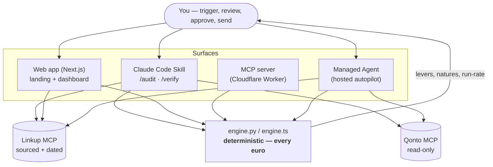
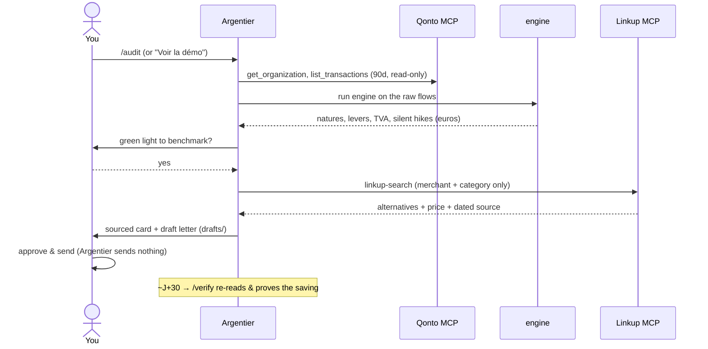
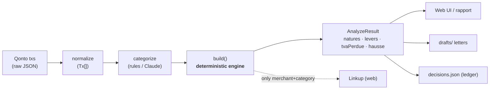

# Argentier — the autonomous CFO agent for Qonto

> **The CFO your business will never hire.** A **read-only** agent on the **Qonto MCP**
> that separates your flows by nature, reveals your true controllable run-rate,
> benchmarks prices on the live web (sourced + dated via **Linkup MCP**), and prepares
> ready-to-send letters — **it never moves money and never sends anything.**
>
> _Prototype for the **Qonto × Anthropic MCP Hackathon**._ · **Operator acts. Analyst explains. Argentier optimizes.**

🌐 **[Live · getargentier.com](https://www.getargentier.com)** — landing + one-click demo · ▶ **[3-min demo (Loom)](https://www.loom.com/share/b9f1a77d8eeb4dd5b0a8699f0c885123)** · Script → [`DEMO.md`](DEMO.md)

---

## Table of contents
- [What it is](#what-it-is) · [Surfaces](#surfaces) · [The loop](#the-loop) · [North Star metric](#north-star--annualized-proven-savings-aps)
- [Architecture](#architecture) — [system](#system-overview) · [user flow](#user-flow) · [data flow](#data-flow)
- [The 4 rules](#the-4-non-negotiable-rules) · [Tech stack](#tech-stack)
- [Setup](#setup) · [File structure](#file-structure) · [Deploy](#deploy) · [Safety](#safety)

---

## What it is

90% of small businesses will never hire a CFO. Their Qonto account is full of data and
nobody to read it — **the statement lies**: it blends recurring tools, structural costs and
one-off spend into one number. Argentier is the missing agent that reads it for them.

**The one architectural decision:** a brain split in two — the **LLM orchestrates and explains**,
a **deterministic engine computes every euro**. The model never does financial arithmetic. That is
what makes every figure auditable.

## Surfaces

| Surface | What it is | State |
|---|---|---|
| **Live site** → **[getargentier.com](https://www.getargentier.com)** | Landing (`/`) + one-click demo (`/demo`): dashboard, **Autopilote**, natures waterfall, savings simulator, tracker board (drag & drop), ready-to-send letters, **5 languages** (FR/EN/DE/ES/IT), **ElevenLabs voice** | ✅ deployed (Vercel) |
| **Claude Code Skill** (`/audit`, `/verify`) | The real agent: Qonto MCP (read-only) → `engine.py` → Linkup MCP → `drafts/` | ✅ works live |
| **MCP server** (`my-app/`) | The deterministic engine exposed as an MCP server on **Cloudflare Workers** — [`argentier-mcp…workers.dev/mcp`](https://argentier-mcp.bonjour-e83.workers.dev/mcp), callable by any MCP client | ✅ live on Cloudflare |
| **Waitlist** | Demo-gate email captured on click → stored in **Cloudflare KV** (`POST /waitlist` on the Worker) | ✅ live |
| **Managed Agent** (`scripts/`) | Script that creates a real **Claude Managed Agent** (hosted autopilot) — verified run | ✅ proof run |

## The loop

```
OBSERVE ─▶ ANALYSE ─▶ BENCHMARK ─▶ RECOMMEND ─▶ GATE ─▶ LEDGER ─▶ (J+30) VERIFY
Qonto MCP   engine.py   Linkup MCP   sourced      human    decisions   re-read &
(read-only) (the euros)  (sourced+    card        approves  .json       prove the
                          dated)                   & sends              money dropped
```

---

## North Star — Annualized Proven Savings (APS)

> **One number: the euros Argentier put back in the account, where the *drop* is proven on the
> real Qonto statement at J+30 and the *annualization* is the deterministic engine's — never the
> LLM's, never "money merely found".**

**North Star Metric (NSM): `economies_prouvees_eur_an`** — the sum of engine-computed
`montant_optimisable_eur` over decisions a human approved *and sent*, where a **J+30 read-only
re-read of the real Qonto account confirmed the recurring debit dropped or vanished** for the
elapsed cycle(s).

```
NSM = Σ montant_optimisable_eur   over decisions where statut = "prouve"
Revenue = 5% × NSM        → user value == business value, by construction ("no savings, no cost")
```

**Two honest halves — what is proven vs. what is projected.** At J+30, `/verify`
(`.claude/commands/verify.md`) re-pulls 90 d of flows read-only, re-runs `engine.py`, and proves the
**monthly drop** actually left the statement. The **×12** on top is `engine.py`'s deterministic
annualization of that proven monthly delta — a projection, not a statement fact. We say *proven
drop, engine-annualized* — not "a proven annual number a customer reads on their statement" (they
read one cycle; the year is the engine's extrapolation).

**Which levers are NSM-eligible** (only those with an observable statement drop):

| Lever | In NSM? | Why |
|---|---|---|
| Recurring sub (`abonnement`, ×12) | ✅ annualized | debit vanishes/shrinks — observable in flows |
| FX fees (`fx`, ×365/90) | ✅ annualized | `fx_card` fees fall — observable |
| Renegotiated hike (`hausse`) | ✅ **only if** the debit visibly drops | a renegotiated amount is observable; a merely *avoided* future hike is **not** → off-NSM "avoided-cost" register |
| Duplicate (`doublon`) | ⚠️ **one-shot recovery, not ×12** | a same-day double charge has nothing recurring to "disappear"; counted in a separate one-shot proven total, never annualized |
| Recoverable VAT (`tva_perdue`) | ❌ **excluded** | a tax-filing outcome, invisible in Qonto flows — `/verify` cannot observe it; tracked off-ledger, accountant-confirmed |

- **Leading indicator** — `economies_en_attente_eur_an`: the aggregate of approved-but-not-yet-proven
  euros, the queue `/verify` draws from. NSM is **lagging by design** (a real proof needs ~30 real
  days of post-action observation — that latency is the feature).
- **Integrity — one hard lock, honestly graded.** The euro counts only if the money stopped leaving
  a **read-only** Qonto account Argentier *cannot write to* — enforced at two layers: every write
  tool hard-denied in `settings.json` (`deny` > `allow`) **and** the Qonto MCP server itself moves no
  money. That is the one architectural guarantee. The other controls — engine-as-sole-arithmetic
  (rule #2, pinned by 24 unit tests), the human gate, net-of-reversal — are **conventions or backlog
  items**, listed as such below, not dressed up as architecture.

**Input tree** (each factor names where it is computed): audits run → qualified source+dated levers
per audit (`engine.py analyze()`) → human approval rate at the GATE (`decisions.json statut`) →
**J+30 proof rate** (`verify.md`) → durability × avg proven € per lever.

**Activation** = the first `/audit` that surfaces ≥1 `engine.py` lever with a sourced+dated Linkup
benchmark **and** a human approves ≥1 recommendation into `drafts/` — logged as the first
`decisions.json` entry with **`statut = "approuve"`** (matching `audit.md` step f; there is no
per-decision `en_attente` state — pending lives only in the aggregate scalar). **Aha** = the first
`/verify` that flips `economies_prouvees_eur_an` from 0 to positive: a drop proven on the user's own
statement, by an agent never allowed to touch the money.

**Guardrails, graded by real enforcement** (not all are architectural — saying so is the point):

| Bound | Enforcement | Grade |
|---|---|---|
| Qonto money-movement = 0 | `settings.json` deny + Qonto MCP cannot move money | **HARD** (two layers) |
| Qonto write tools invoked = 0 | 8-read-tool allowlist | **HARD** |
| PII to web = 0 | `audit.md` prompt only (`linkup`/`brightdata` args unrestricted) | **SOFT** — backlog: arg filter |
| Autonomous sends = 0 | `drafts/` label convention; non-Qonto send MCPs **not** denied | **SOFT** — backlog: deny Gmail/Instantly/Apollo |
| Displayed € = engine € | rule #2 convention + 24 engine tests | **SOFT+tests** — backlog: assert displayed==engine |
| Net-of-reversal | not implemented (`/verify` re-reads only `approuve`) | **BACKLOG** |
| Untouchable suppliers respected | `profile.json` prompt-checked (empty; engine doesn't read it) | **SOFT** — backlog: wire into engine |

> **Receivables metrics** (DSO / *délai moyen de paiement*, *impayés*, acceptance rate) are **not**
> in this NSM — Argentier is cost-recovery today and computes none of them from its own data. They
> are scoped to a **future receivables module** (roadmap), the day it reads `list_client_invoices`.
> See [`docs/product-metrics.md`](docs/product-metrics.md) for the full framework, honest
> instrumentation status, and hardening backlog.

---

## Architecture

### System overview



*Guardrail:* every Qonto **write** tool is hard-denied in [`.claude/settings.json`](.claude/settings.json)
(`deny` > `allow`). Argentier cannot move money.

### User flow



### Data flow



**Zero PII to the web:** only the merchant name + category ever leave the machine (never an
IBAN, `transaction_id`, or personal data).

---

## The 4 non-negotiable rules

1. **Read-only Qonto** — only read tools; every write/transfer/card tool is hard-denied.
2. **The engine computes, never the LLM** — every euro comes from `engine.py` / `engine.ts`.
3. **Zero PII to the web** — only merchant + category go to Linkup.
4. **Price = source + date** — otherwise "not verified" (1 retry, then dropped).

## Tech stack

| Layer | Tech |
|---|---|
| Agent engine | **Python** (`engine.py`) — deterministic, `unittest` |
| Web app | **Next.js 15** / React 19 / TypeScript, CSS-in-JS, no UI framework |
| Web engine mirror | **TypeScript** (`web/lib/engine.ts`) — same rules as `engine.py` |
| LLM | **Claude** (Anthropic SDK) — categorization + letters (labels only, never euros) |
| MCPs | **Qonto** (read-only), **Linkup** (benchmark) |
| Voice | **ElevenLabs** — TTS (`/api/voice`) + Conversational widget |
| MCP server | **Cloudflare Workers** + `agents` (`McpAgent`) + `@modelcontextprotocol/sdk` |
| Hosted agent | **Claude Managed Agents** (beta) |

---

## Setup

### 1. Deterministic engine (Python)
```bash
python3 -m unittest discover -s tests      # 24 rule tests (recurrence, ×12, duplicates, FX, PRO/PERSO, hikes, VAT)
python3 engine.py data/exemple-demo.json   # see the engine on a sample
```

### 2. The Claude Code skill (the submission)
Open this repo in **Claude Code** with the Qonto + Linkup MCPs connected, then:
```
/audit      # OBSERVE → ANALYSE → BENCHMARK → RECOMMEND → drafts
/verify     # ~30 days later: prove the saving landed
```

### 3. Web app (landing + dashboard)
```bash
cd web
cp env.example .env.local      # fill keys (or leave empty → demo data)
npm install
npm run dev                    # http://localhost:3000
```
`.env.local` keys: `ANTHROPIC_API_KEY`, `LINKUP_API_KEY`, `QONTO_LOGIN`/`QONTO_SECRET_KEY`/`QONTO_IBAN`,
`ELEVENLABS_API_KEY` (+ optional `ELEVENLABS_VOICE_ID`, `NEXT_PUBLIC_ELEVENLABS_AGENT_ID`).
Without Qonto/Anthropic keys the app runs on **demo data** (mock).

### 4. MCP server on Cloudflare (`my-app/`)
```bash
cd my-app
npm install --legacy-peer-deps
npx wrangler@4.110.0 dev       # local  →  POST http://localhost:8787/mcp
npx wrangler@4.110.0 login && npx wrangler@4.110.0 deploy   # publish (needs your Cloudflare OAuth)
```
Exposes 4 tools: `argentier_rules`, `argentier_classify_ei`, `argentier_annualize`, `argentier_analyze`.

### 5. Real Managed Agent (`scripts/`)
```bash
node scripts/create-cma-agent.mjs          # reads ANTHROPIC_API_KEY from web/.env.local
```
Creates a hosted CMA agent + session that runs a task in a sandbox. See [`docs/autopilote-cma-spec.md`](docs/autopilote-cma-spec.md).

---

## File structure

```
DAF Qonto/
├─ engine.py                 # deterministic engine (the numbers) — source of truth
├─ tests/test_engine.py      # 24 rule tests
├─ SKILL.md                  # the Argentier skill (MCP-native orchestration)
├─ .claude/
│  ├─ settings.json          # read-only guardrail (deny > allow)
│  └─ commands/              # /audit, /verify
├─ web/                      # Next.js app (landing + dashboard)
│  ├─ app/
│  │  ├─ page.tsx            # landing ↔ app toggle
│  │  ├─ Landing.tsx         # marketing landing (Qonto-styled)
│  │  ├─ Argentier.tsx       # the dashboard (Autopilote, waterfall, board, voice…)
│  │  └─ api/                # analyze · benchmark · letter · voice
│  └─ lib/                   # engine.ts · categorize.ts · types.ts · i18n.ts · mock.ts
├─ my-app/                   # MCP server on Cloudflare Workers (McpAgent)
│  └─ src/index.ts + src/lib # engine reused verbatim
├─ scripts/create-cma-agent.mjs   # real Claude Managed Agent
├─ docs/                     # product-metrics (North Star) · PRD · CMA spec · landing/Cloudflare · voice setup
└─ data/, drafts/            # real flows, ledger, deliverables (gitignored)
```

---

## Deploy

- **Web app** → Cloudflare Pages (`@cloudflare/next-on-pages`) or Vercel.
- **MCP server** → `cd my-app && npx wrangler@4.110.0 login && npx wrangler@4.110.0 deploy`.
- **Custom domain** `getargentier.com` → add it in the Cloudflare dashboard (Workers/Pages → Custom domains)
  or `wrangler` route. All keys live in **Cloudflare secrets** (`wrangler secret put`), never in the repo.

## Safety

Read-only on Qonto; never initiates a payment, transfer, or card change. Benchmarks send only a
merchant name + category. Tax suggestions are leads to confirm with an accountant. **You are always
the one who sends.**

---

**The CFO your business will never hire.**
