# meet2invoice

**A sales call becomes a provable Qonto invoice — the document never leaves your machine.**

A [Claude Code](https://claude.com/claude-code) skill on the official Qonto MCP.
Feed it a meeting artifact — a call transcript, notes, a calendar event, in any
of five languages — and it extracts the deal, previews it for your approval,
creates the Qonto quote, hashes the authoritative PDF **locally**, and on
acceptance finalizes and sends an invoice with that SHA-256 baked into its
footer. Two confirmation gates. Zero documents uploaded anywhere. Only the
hash travels.

<p align="center">
  <a href="architecture.html">
    
  </a>
  <br>
  <sub>↑ static preview — open <a href="architecture.html"><code>architecture.html</code></a> for the real, self-contained interactive version (light/dark aware, zero build step)</sub>
</p>



```mermaid
flowchart LR
    A["📞 Meeting artifact\n(transcript · notes · calendar)"] --> B["🧠 Extract & preview\nclient · amount · VAT · terms"]
    B -. "◆ Gate 1 — you confirm" .-> C["📄 create_quote\npublic quote_url + PDF"]
    C --> D["🔒 Hash locally\nSHA-256 — file never leaves disk"]
    D --> E["🧾 Invoice + proof\nhash injected in terms_and_conditions"]
    E -. "◆ Gate 2 — you confirm" .-> F["✅ Finalized & sent\nproof rendered in the PDF footer"]

    classDef local fill:#DCEBE2,stroke:#2E7D5B,color:#18161C;
    classDef qonto fill:#E3E2EF,stroke:#3B3A63,color:#18161C;
    class D local
    class C,F qonto
```

## Why this matters

After every sales call, someone re-types the deal — scope, amount, VAT,
payment terms — into a finance tool. meet2invoice closes that loop from the
raw meeting artifact straight to a finalized, sent Qonto invoice:

- **Guarded action.** Nothing is written to Qonto without an explicit preview
  and confirmation — once before the quote, once before the invoice.
- **Zero document exfiltration.** The authoritative quote PDF is downloaded
  and hashed locally (`shasum -a 256`). Only the 64-hex-char SHA-256 travels
  back into Qonto, rendered in the footer of the finalized invoice PDF.
- **Law-aware.** VAT treatment (domestic / intra-EU reverse charge / export /
  small-business schemes) is decided from the parties' countries via
  [`references/invoicing-law.md`](references/invoicing-law.md), including the
  mandatory legal mentions — written in the client's language.
- **No money movement.** Quotes and invoices only; payments always stay with
  Qonto and the user's own Strong Customer Authentication.

## Quick start

1. Connect the [Qonto MCP server](https://qonto.com) in Claude Code.
2. Copy this folder into your skills directory (or clone `qonto/skills`).
3. Feed it a meeting artifact:

   - "Here's the transcript from my Bouygues call — meet2invoice it."
   - 🇩🇪 "Mach aus diesem Telefonprotokoll ein Angebot und dann die Rechnung."
   - 🇫🇷 "Cet appel est clôturé — facture en autoliquidation, TVA 0, mentions OK."
   - 🇮🇹 "Deal chiuso: crea la fattura, IVA 22%, serve il codice destinatario SdI."
   - 🇪🇸 "Crea un borrador de factura con IVA 21%, pero no la emitas ni la envíes."

   Sample transcripts for every case live in [`demo/`](demo/).

## Sample output (real sandbox run)

[`demo/transcript.md`](demo/transcript.md) — a closed FR-domestic deal — run
end-to-end against the official Qonto sandbox: client created → quote
**D-2026-005** → PDF hashed locally → invoice **F-2026-005** finalized with
the hash injected → sent.

<table>
<tr>
<td width="50%" align="center"><b>Quote — proof anchor, never sent to the client</b></td>
<td width="50%" align="center"><b>Invoice — sent, with the proof in its footer</b></td>
</tr>
<tr>
<td></td>
<td></td>
</tr>
</table>

**The proof, rendered in the official Qonto invoice PDF footer:**


```console
$ scripts/verify-proof.sh quote-D-2026-005.pdf invoice-F-2026-005.pdf
SHA-256 (local)   d01d8a77fb828e6b581b17e72df601c70fd09196bf45f433a946a3a1580e7d11

✔ PROOF VERIFIED
  The invoice PDF contains the full SHA-256 of the local quote PDF.
  The document never left this machine — only the hash traveled.
```

> Contact email redacted in the screenshots above (sandbox account, not the
> client's data). The client's tax ID and street address are sandbox
> placeholders, flagged to the user at Gate 1 because the source transcript
> never mentioned them — meet2invoice never invents legal data silently.

## Verify the proof yourself

```bash
scripts/verify-proof.sh quote.pdf invoice.pdf
# ✔ PROOF VERIFIED
#   The invoice PDF contains the full SHA-256 of the local quote PDF.
#   The document never left this machine — only the hash traveled.
```

Works offline with no MCP and no dependencies beyond `shasum`
(uses `pdftotext` when available, otherwise a built-in python3 fallback).

**Both sides of the deal can run this.** The freelancer verifies before
sending. The company that hired them downloads the quote PDF from the public
`quote_url` and independently checks that the invoice in their inbox matches
the quote they accepted — no Qonto account, no trust in the sender required.

## Production-ready, not demo-ware

Every call is a GA Qonto Business API endpoint through the official MCP — the
identical flow runs on a real account today. The skill documents exactly what
changes in production (SCA prompts on sensitive writes, multi-account IBAN
selection, manual-numbering orgs, currency handling, FR/DE/IT e-invoicing
mandates, payment links once a provider is connected) and handles real cases
the demo never shows: existing-quote escalation, B2C vs B2B VAT, non-EU
exports, seller small-business schemes (§19 UStG / art. 293 B CGI), credit
notes and payment lifecycle after send. Validated end-to-end against the
official sandbox — including a full intra-EU reverse-charge invoice with the
mandatory legal mention, offline-verified proof, and a localized client email.

## What this skill deliberately does NOT do

- It never moves money, creates transfers, or touches payment approval.
- It never sends an invoice without the second confirmation gate.
- It never uploads your documents anywhere — only the hash travels.
- It does not give legal or tax advice; it applies documented invoicing rules
  and asks when data (VAT ID, rate, country, tax ID) is missing.
- Recurring/retainer invoices and deposit (down-payment) invoices are not
  automated yet — create them in Qonto directly; the skill focuses on the
  deal-to-first-invoice loop.

## Contents

| Path | Purpose |
|---|---|
| `SKILL.md` | The skill definition (flow, gates, verified tool chain, error handling) |
| `architecture.html` | Self-contained interactive architecture diagram (light/dark, no build step) |
| `scripts/verify-proof.sh` | Offline proof verifier (quote hash ↔ invoice footer) |
| `references/invoicing-law.md` | Per-country VAT / e-invoicing rules used at extraction time |
| `demo/` | Multi-language demo transcripts + the video scripts |
| `demo/sample-output/` | Screenshots from a real sandbox run (this README's images) |
| `sign-ring/` | Optional zero-dependency signature MCP (hash-only multi-party sign-off) |
| `SANDBOX-VALIDATION.md` | Full validation log against the official Qonto sandbox MCP |

Validated end-to-end against the official Qonto sandbox MCP:
`create_quote` → `get_attachment` → local hash → `create_client_invoice` (proof
in `terms_and_conditions`) → finalize → footer renders the proof → `send_client_invoice`.
