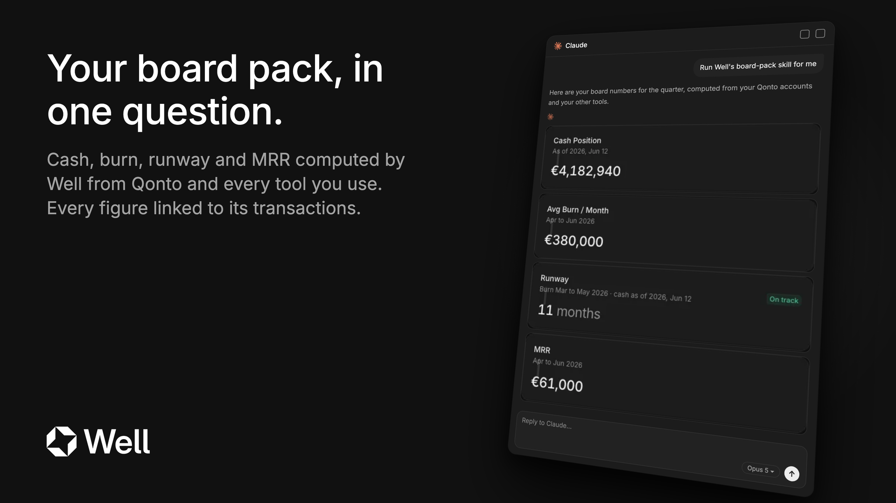

# Well for Qonto

Board-ready finance numbers for Qonto customers, computed by [Well](https://wellapp.ai) across Qonto and every other connected bank and tool.

## Install

1. Connect Qonto. On claude.ai or Claude Desktop, use the official Qonto connector. In Claude Code:
   `claude mcp add --transport http qonto https://mcp.qonto.com/mcp`
2. Connect Well. The plugin's `.mcp.json` declares it for Claude Code. Elsewhere, add the Well connector at
   `https://api.wellapp.ai/v1/mcp`.
3. Install the plugin from the Qonto marketplace and ask for your board pack.

## Skills

| Skill | Ask | What you get |
|---|---|---|
| `board-pack` | "Put my board pack together" · "Prépare mon board pack" | Cash, burn, runway, recurring revenue, receivables and payables, each with its window and scope |

## How it works

Each skill reads the Qonto organization and balances through the Qonto MCP, and Well's MCP server computes every figure. The instructions the skill follows are all in this plugin (`skills/<skill>/SKILL.md` and its `references/`): nothing is loaded from Well at run time, and no other skill is run. A change to the steps ships as a new version of this plugin, reviewed here.

## Scope

Reads Qonto and writes nothing to Qonto. Inside the Well workspace, two changes are possible, each made by the user on a card: attaching a bank account to a company, and setting a transaction's category. The skill never makes either change itself. Not financial or tax advice.
